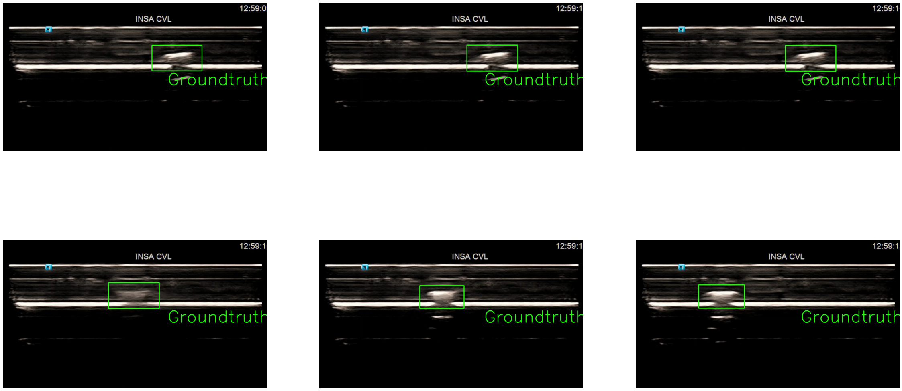
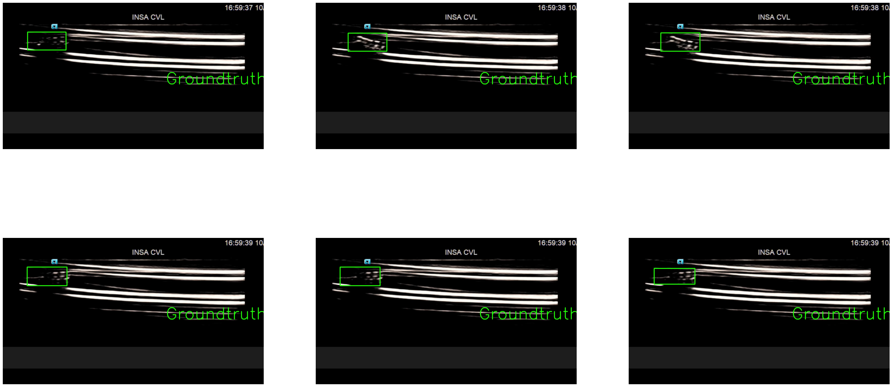
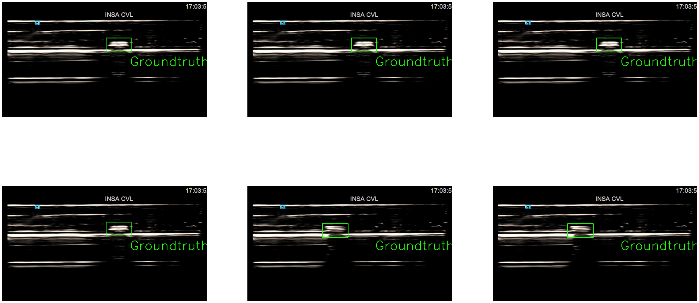
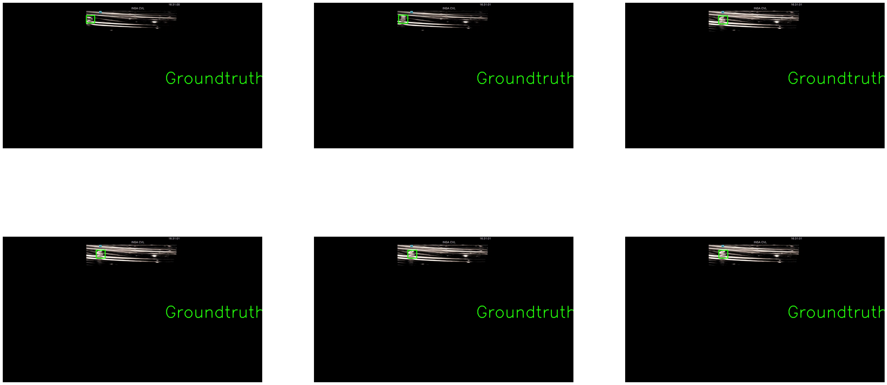
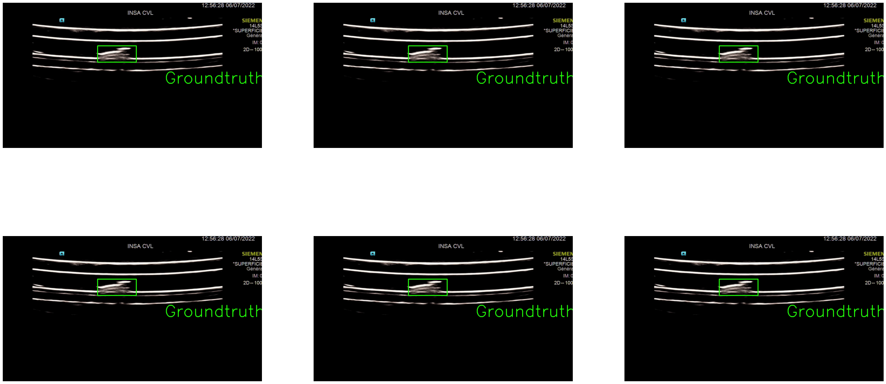
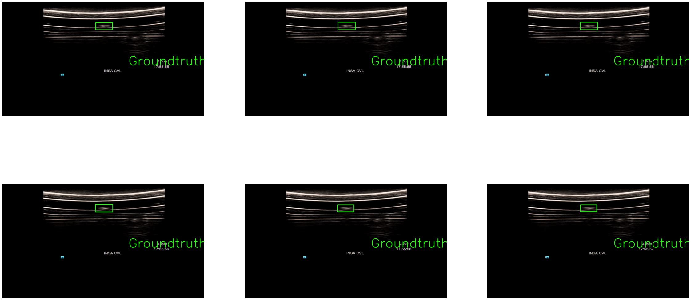
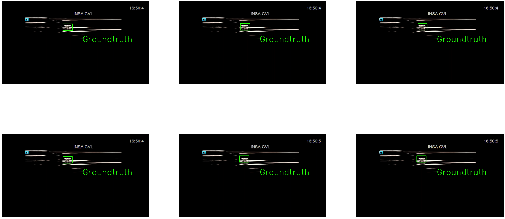
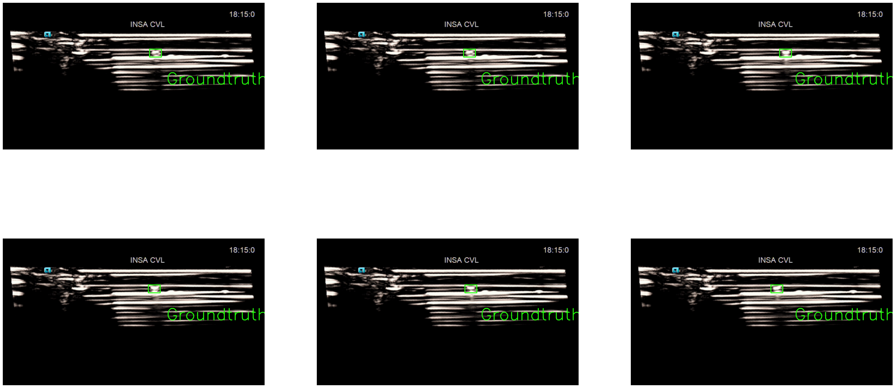

# USMicroMagSet: Using deep learning analysis to benchmark the performance of microrobots in ultrasound images.


## Dataset contents
We are presenting a US image microrobots dataset, that consists of 8 microrobots grouped in 3 Locomotion principals. 

* Microrobot Class: SMF - Steering magnetic field
    1. Sphere
    2. Cube 
    3. Cylinder
* Microrobot Class: RMF - Rotating magnetic field
    1. Helical 
    2. Soft Sheet
    3. Rolling Cube
* Microrobot Class: OMF - Oscilating magnetic field. 
    1. Flagella
    2. Chainlike Robot - (Sphere3 folder)

We have recorded the microrobots back and forth in a microfludic channel using 14L5 SP Ultrasound probe (Siemens).
The videos are 10 min each for each microrobot.
From theses videos 40K images are extracted.

<!--
format 2 is for the Tracking format of the same dataset located at (USMicroMagSet_For_tracking) folder, to enable the community to either build their own image detector or image tracker. 
-->

We have created a module to visualize the dataset called USMMgSt included with the dataset.

# Licensing
USMicroMagSet/Ultrasound Micro Magnetic Dataset is free dataset provided under the GNU General Public License (GPLv3). For more information see the license file. We distribute this dataset freely to endorse the use and development of the detection and tracking of microrobots in scientific domain. If you use USMicroMagSet in an academic setting please cite the following paper. If you are interested in a commercial license, please contact me.

Please cite this work as:
    
> Botros K., Mohammad A., Folio D., and Ferreira A., “USMicroMagSet: Using Deep Learning Analysis to Benchmark the Performance of Microrobots in Ultrasound Images,” Robot. Autom. Lett., pp. 1–8, 2023. doi: [10.1109/10.1109/LRA.2023.3264746](https://doi.org/10.1109/10.1109/LRA.2023.3264746)


## Dataset Samples:

```python
labels , images = USMMgSt.readrobot("cube",3)
fig, ax = plt.subplots(nrows=2, ncols=3, figsize=(40,20))
for a in ax.ravel():
    a.axis('off')

for i in range(1,7):
    plt.subplot(2, 3, i)
   
    USMMgSt.plotimage_withbbox(images[i],labels.iloc[i][1:5])
```


    

    


```python
labels , images = USMMgSt.readrobot("helical",1)
fig, ax = plt.subplots(nrows=2, ncols=3, figsize=(40,20))
for a in ax.ravel():
    a.axis('off')

for i in range(1,7):
    plt.subplot(2, 3, i)
   
    USMMgSt.plotimage_withbbox(images[i],labels.iloc[i][1:5])
```


    

    


```python
labels , images = USMMgSt.readrobot("cylinder",3)
fig, ax = plt.subplots(nrows=2, ncols=3, figsize=(40,20))
for a in ax.ravel():
    a.axis('off')

for i in range(1,7):
    plt.subplot(2, 3, i)
   
    USMMgSt.plotimage_withbbox(images[i],labels.iloc[i][1:5])


```


    

    


```python
labels , images = USMMgSt.readrobot("rollingcube",3)
fig, ax = plt.subplots(nrows=2, ncols=3, figsize=(40,20))
for a in ax.ravel():
    a.axis('off')

for i in range(1,7):
    plt.subplot(2, 3, i)
   
    USMMgSt.plotimage_withbbox(images[i],labels.iloc[i][1:5])
```


    

    


```python
labels , images = USMMgSt.readrobot("flagella",3)
fig, ax = plt.subplots(nrows=2, ncols=3, figsize=(40,20))
for a in ax.ravel():
    a.axis('off')

for i in range(1,7):
    plt.subplot(2, 3, i)
   
    USMMgSt.plotimage_withbbox(images[i],labels.iloc[i][1:5])
```


    

    


```python
labels , images = USMMgSt.readrobot("sheetrobot",3)
fig, ax = plt.subplots(nrows=2, ncols=3, figsize=(40,20))
for a in ax.ravel():
    a.axis('off')

for i in range(1,7):
    plt.subplot(2, 3, i)
   
    USMMgSt.plotimage_withbbox(images[i],labels.iloc[i][1:5])
```


    

    


```python
import USMMgSt
import importlib
importlib.reload(USMMgSt)
```


    <module 'USMMgSt' from 'g:\\deeplearning\\dataset_tracking\\DatasetBackup\\USMMgSt.py'>


```python
labels , images = USMMgSt.readrobot("sphere3",3)
fig, ax = plt.subplots(nrows=2, ncols=3, figsize=(40,20))
for a in ax.ravel():
    a.axis('off')

for i in range(1,7):
    plt.subplot(2, 3, i)
   
    USMMgSt.plotimage_withbbox(images[i],labels.iloc[i][1:5])


```


    

    


```python
labels , images = USMMgSt.readrobot("sphere1",3)
fig, ax = plt.subplots(nrows=2, ncols=3, figsize=(40,20))
for a in ax.ravel():
    a.axis('off')

for i in range(1,7):
    plt.subplot(2, 3, i)
   
    USMMgSt.plotimage_withbbox(images[i+2],labels.iloc[i+2][1:5])
```


    

    


```python

```
